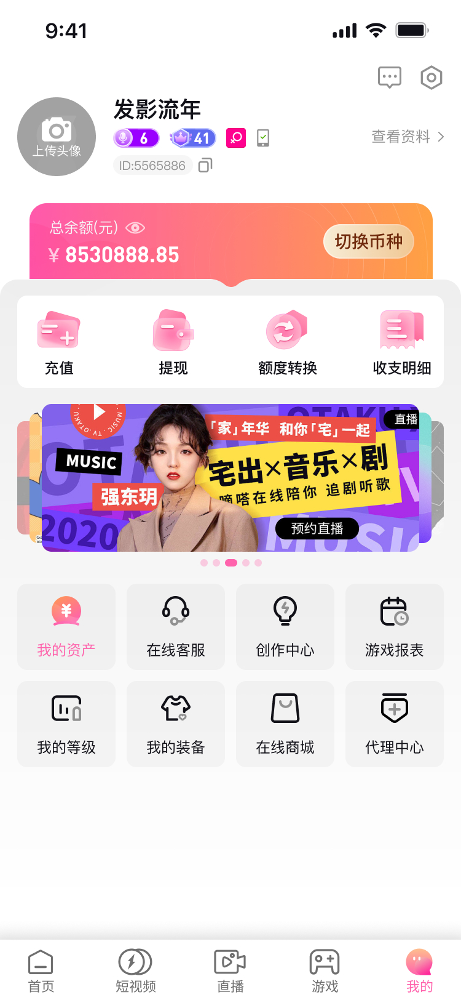
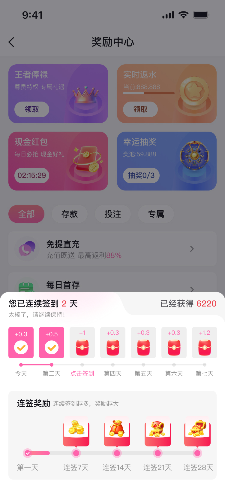
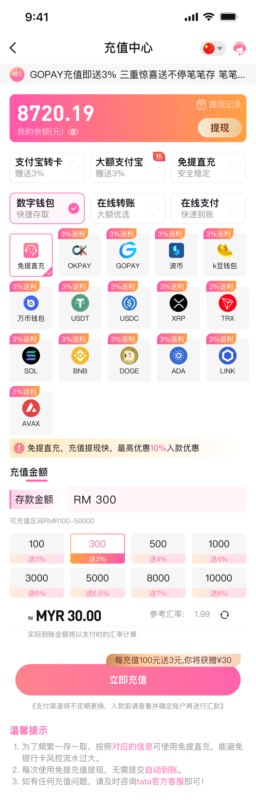
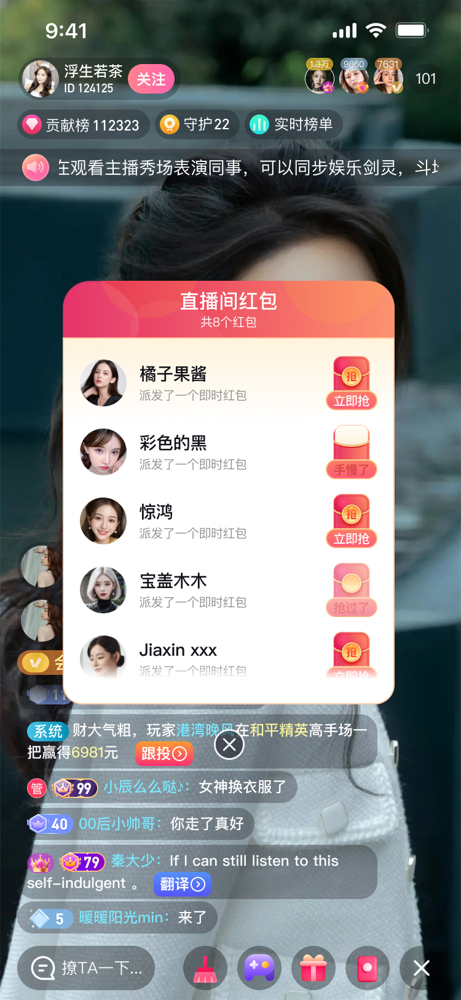
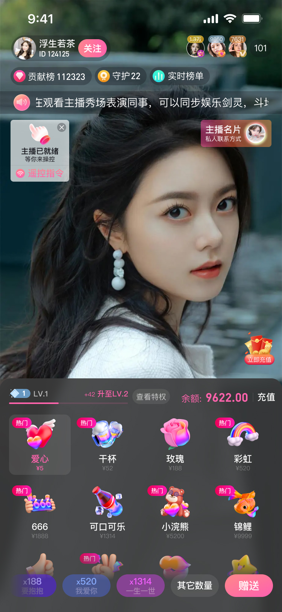

# PhoneLive iOS 直播应用

---

## 开源宣言

> 本项目原为商业委托开发。合作方**恶意克扣劳动报酬**、**将项目问题与责任悉数推诿于开发者**，既无契约精神，亦无对劳动者最基本的尊重，行径卑劣。本人不愿更多同行再被此类无良行径所害，**出于人道主义**将本仓库公开，供有需要的开发者参考、学习与二次开发，望大家少走弯路、免受其苦；若你曾遭遇欠薪、甩锅或类似不公，愿这份代码能为你所用，也算对无良商家的一种回应。  
> **无良商家不该被沉默纵容。** 若你也曾遭遇克扣工资、强行背锅、过河拆桥等不公，欢迎在 Issues 或讨论区**实名或匿名曝光**涉事公司/项目/对接人，附上可核实的信息（如合同条款、沟通记录、欠薪证据等），让更多开发者避坑。众人拾柴，把无良商家晒在阳光下，才能让守信者得利、让失信者寸步难行，共建对开发者更公平的行业环境。本仓库愿成为**曝光与互助**的一处据点：既分享代码，也汇聚经历与声音。

---

## 项目概述

PhoneLive 是一个功能完善的 iOS 直播社交平台应用，集成了直播、短视频、游戏、社交等多种功能。该应用采用 Objective-C 为主要开发语言，部分功能使用 Swift 实现，支持多渠道打包和发布。

### 应用截图

| 个人中心-会员端 | 主播任务-签到 | 免提直充 | 注册-手机号登录 |
|:---:|:---:|:---:|:---:|
|  |  |  |  |

| 游戏中心-热门 | 直播-直播间红包-B版 | 短视频-关注 | 赠送礼物 |
|:---:|:---:|:---:|:---:|
|  |  |  |  |

## 主要功能

### 1. 直播功能
- **主播开播**: 支持主播开启直播间进行实时直播
- **观众观看**: 用户可以浏览和观看各类直播内容
- **实时互动**: 
  - 实时聊天和弹幕
  - 虚拟礼物赠送系统
  - 红包功能
  - 连麦互动
- **美颜滤镜**: 集成相芯科技 SDK，提供实时美颜、滤镜、贴纸等特效

### 2. 短视频功能
- **视频拍摄**: 支持拍摄和上传短视频
- **视频浏览**: 类似抖音的上下滑动浏览模式
- **社交互动**: 点赞、评论、分享、关注等功能

### 3. 游戏中心
- **游戏大厅**: 提供多种休闲游戏
- **彩票功能**: 包含转盘、抽奖等博彩元素
- **游戏币系统**: 独立的游戏货币体系

### 4. 社交系统
- **用户体系**:
  - 手机号注册/登录
  - 游客登录
  - 第三方登录
- **社交功能**:
  - 关注/粉丝系统
  - 私信聊天
  - 动态发布
  - 用户等级系统
- **排行榜**: 主播榜、富豪榜、贡献榜等

### 5. 支付与变现
- **虚拟货币**: 钻石、金币双货币体系
- **充值系统**: 支持多种支付方式
- **提现功能**: 主播收益提现
- **VIP会员**: 会员特权体系
- **守护系统**: 用户可成为主播守护者

### 6. 特色功能
- **计时收费**: 私密直播间按分钟计费
- **一元空降**: 付费进入指定直播间
- **遥控指令**: 互动控制功能
- **任务系统**: 每日任务和成就系统

## 技术架构

### 开发环境
- 开发语言: Objective-C + Swift
- 最低支持版本: iOS 11.0
- 开发工具: Xcode
- 包管理: CocoaPods

### 项目结构
```
Live_iOS2/
├── PhoneLive/                 # 主应用入口
│   ├── appdelegate/          # 应用代理
│   ├── Supporting Files/      # 配置文件
│   └── 启动图/               # 启动页资源
├── PhoneLiveSDK/             # 核心SDK
│   ├── Project/              # 主要功能模块
│   │   ├── 开始观看直播/      # 直播观看
│   │   ├── 个人中心/         # 用户中心
│   │   ├── 短视频/           # 短视频功能
│   │   ├── 游戏中心/         # 游戏模块
│   │   ├── 消息/             # 消息系统
│   │   ├── 支付相关/         # 支付模块
│   │   └── 工具类/           # 工具类
│   └── SDK/                  # 第三方SDK集成
├── Pods/                     # CocoaPods依赖
└── fastlane/                 # 自动化打包配置
```

### 核心依赖库
- **网络框架**: AFNetworking
- **UI框架**: 
  - Masonry (自动布局)
  - MBProgressHUD (加载提示)
  - IQKeyboardManager (键盘管理)
  - JXCategoryView (分类视图)
- **图片处理**: 
  - YYWebImage (图片加载)
  - TZImagePickerController (图片选择)
- **动画**: SVGAPlayer (礼物特效)
- **数据解析**: MJExtension (JSON映射)
- **加密**: FFAES, OpenSSL
- **统计分析**: 
  - 友盟统计 (UMCommon)
  - GrowingIO
- **云存储**: 七牛云 (Qiniu)
- **实时通讯**: Socket (聊天系统)

### 多渠道配置
项目支持多个渠道包的构建：
- c700LIVE (主版本)
- c601PLAY, c608PLAY, c609PLAY
- c623PLAY, c625PLAY, c627PLAY
- 各渠道有独立的配置文件和资源

## API架构

### 网络请求
- 基础URL格式: `{domain}/v1/?service={ServiceName}.{MethodName}`
- 请求加密: AES加密
- 认证方式: Token认证
- 域名管理: 动态域名配置，支持域名屏蔽保护

### 主要API模块
- `User.*` - 用户管理
- `Home.*` - 首页内容
- `Live.*` - 直播相关
- `Login.*` - 登录认证
- `Message.*` - 消息系统
- `Task.*` - 任务活动
- `Video.*` - 视频相关
- `Game.*` - 游戏相关

## 构建与部署

### 环境要求
- macOS 10.15+
- Xcode 12.0+
- CocoaPods 1.10+
- Ruby 2.6+ (用于fastlane)

### 安装步骤
1. 克隆项目
```bash
git clone [repository-url]
cd Live_iOS2
```

2. 安装依赖
```bash
pod install
```

3. 打开工作空间
```bash
open phonelive2.xcworkspace
```

### 自动化打包
项目集成了 fastlane 自动化打包工具：
```bash
# 安装 fastlane
bundle install

# 执行打包
fastlane [lane_name]
```

## 安全与合规

### 数据安全
- API请求使用AES加密
- 敏感数据本地存储加密
- 用户隐私数据保护

### 权限使用
- 相机权限: 直播和拍摄
- 麦克风权限: 直播和语音
- 相册权限: 图片/视频选择
- 通知权限: 推送通知
- 位置权限: 附近的人功能

## 版本管理

当前分支: `3.0.0打包`
主分支: `main`

### 版本号规则
- 主版本号: 重大功能更新
- 次版本号: 功能优化和新增
- 修订号: Bug修复

## 注意事项

1. **多语言支持**: 项目支持中文简体、繁体、英语、日语、印尼语、越南语
2. **内容审核**: 直播内容需要通过审核系统
3. **支付合规**: 涉及虚拟货币交易，需遵守相关法规
4. **年龄限制**: 部分功能有年龄限制要求

## 联系方式

如有技术问题或合作需求，请联系技术团队。

---

最后更新时间: 2025-07-09
